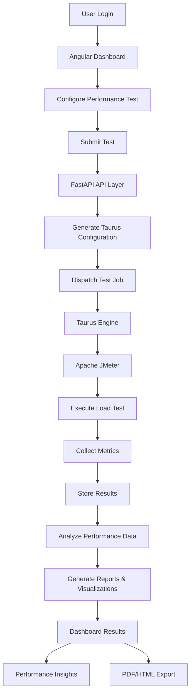

# PerfAnalyzer

PerfAnalyzer is a web-based platform that automates performance testing of websites and web applications using Apache JMeter and Taurus. It provides an intuitive dashboard for configuring tests, executing load scenarios, and analyzing performance metrics through detailed reports and visualizations.

## Features

- Web-based test configuration and execution
- Integration with Apache JMeter and Taurus
- Load, Stress, Spike, and Endurance Testing
- Real-time test monitoring
- Performance metrics and analytics
- Historical test result storage
- Interactive reports and visual dashboards

## Tech Stack

### Frontend
- Angular
- TypeScript
- Angular Material
- Chart.js

### Backend
- FastAPI
- Python

### Performance Testing
- Apache JMeter
- Taurus


## Workflow


```mermaid
flowchart TD
A[User Login] --> B[Angular Dashboard]
B --> C[Configure Performance Test]
C --> D[Submit Test]
D --> E[FastAPI API Layer]
E --> F[Generate Taurus Configuration]
F --> G[Dispatch Test Job]
G --> H[Taurus Engine]
H --> I[Apache JMeter]
I --> J[Execute Load Test]
J --> K[Collect Metrics]
K --> L[Store Results]
L --> M[Analyze Performance Data]
M --> N[Generate Reports & Visualizations]
N --> O[Dashboard Results]
O --> P[Performance Insights]
O --> Q[PDF/HTML Export]
```

## Status

🚧 Project under development.

## Project Structure
```
PerfAnalyzer/
├── .env                        ← Root env 
├── Jenkinsfile                 ← Jenkins Declarative Pipeline
├── requirements.txt
├── JMeter/
│   └── apache-jmeter-5.6.3/   ← Bundled JMeter engine
├── Test Result/                ← All test output folders
│   └── <test_name>/
│       ├── kpi.jtl
│       ├── jmeter.log
│       └── HTML_Report/
│           └── index.html      ← Custom + JMeter generated report
├── perfAnalyzer-backend/
│   ├── .env                    
│   ├── main.py                 ← All FastAPI routes 
│   ├── models.py               ← Pydantic models
│   ├── jmx_builder.py          ← JMX XML generator
│   ├── yaml_builder.py         ← Taurus YAML generator
│   ├── template.yml            ← Base Taurus config template
│   ├── generated.yml           ← Runtime-generated Taurus config
│   ├── generated_tests/        ← Auto-created .jmx + .yml from /create-test
│   ├── project_files/          ← Uploaded workspace files per project
│   └── services/
│       └── endpoint_discovery.py ← 5-strategy API auto-discovery
└── perfAnalyzer-frontend/
    └── src/app/
        ├── api.service.ts       ← Angular singleton HTTP service
        ├── app.routes.ts        ← Client-side routing
        └── components/
            ├── auth/            ← User login/register
            ├── admin-auth/      ← Super admin login
            ├── admin-dashboard/ ← User management + analytics
            ├── dashboard/       ← Live test monitoring
            ├── create-test/     ← Auto-generate JMX from URL
            ├── overview-dashboard/ ← Gives the overview of all the tests +  
            ├── test-config/     ← Upload JMX/CSV + configure params
            ├── projects/        ← Project workspaces
            ├── test-queue/      ← Unified queue 
            ├── reports-history/ ← Past test results
            ├── reports/         ← HTML report viewer
            ├── logs/            ← Log viewer
            └── navbar/          ← Navigation bar
```

## Future Enhancements

- Distributed Load Testing
- AI-Powered Performance Insights
- Scheduled Test Execution ✔️
- PDF Report Export ✔️
- Team Collaboration Features
