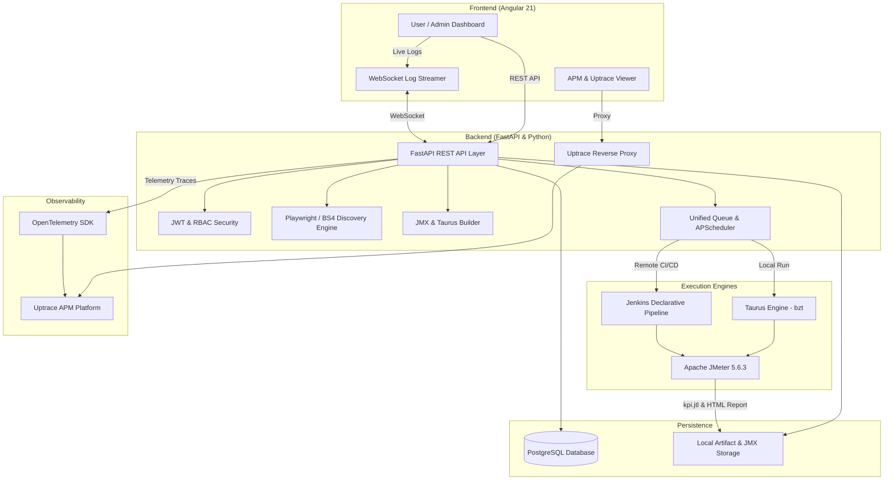

# PerfAnalyzer 🚀

[](https://fastapi.tiangolo.com)
[](https://angular.dev)
[](https://jmeter.apache.org)
[](https://gettaurus.org)
[](https://www.postgresql.org)
[](https://opentelemetry.io)
[](https://www.jenkins.io)
[](LICENSE)

**PerfAnalyzer** is an enterprise-ready, web-based performance testing, load automation, and APM observability platform. It automates test creation, execution, queue orchestration, and telemetry analytics using **Apache JMeter** and **Taurus**, coupled with deep distributed tracing via **OpenTelemetry** and **Uptrace**, and bi-directional **Jenkins CI/CD** automation.

---

## 📑 Table of Contents

- [Key Features](#-key-features)
- [System Architecture & Workflow](#-system-architecture--workflow)
- [Tech Stack](#-tech-stack)
- [Project Structure](#-project-structure)
- [Prerequisites](#-prerequisites)
- [Installation & Getting Started](#-installation--getting-started)
  - [1. Database Setup](#1-database-setup)
  - [2. Backend Configuration](#2-backend-configuration)
  - [3. Frontend Setup](#3-frontend-setup)
- [Environment Variables](#-environment-variables)
- [Jenkins CI/CD Integration](#-jenkins-cicd-integration)
- [APM & Observability (OpenTelemetry & Uptrace)](#-apm--observability-opentelemetry--uptrace)
- [API Overview](#-api-overview)
- [License](#-license)

---

## 🌟 Key Features

### 1. 🛠️ Intelligent Test Authoring & Endpoint Auto-Discovery
- **5-Strategy Web Crawler & Discovery Engine**: Automatically crawls target web applications using Playwright headless browser, BeautifulSoup, DOM parser, form extraction, and sitemap exploration to auto-generate JMeter scenarios.
- **Dynamic Test Generation**: Generate production-grade JMeter `.jmx` XML scripts and Taurus YAML execution configs on the fly from simple URLs or REST specs.
- **Custom Scenario Building**: Configure Virtual Users (threads), Ramp-up periods, Hold durations, HTTP methods, headers, and CSV dataset parametrization.

### 2. ⚡ Flexible Load Execution Engine
- **Local Taurus Engine**: On-demand test execution powered by the Taurus CLI (`bzt`) with the bundled Apache JMeter 5.6.3 engine.
- **Distributed & Remote CI/CD Execution**: Seamless integration with **Jenkins Declarative Pipelines** to offload and execute load tests across dedicated Jenkins test agents.
- **Test Scenarios**: Execute Load, Stress, Spike, Soak, and Endurance performance scenarios.

### 3. 📊 Real-Time Monitoring & Deep Analytics
- **Live WebSocket Streaming**: Real-time test log streaming and status synchronization directly to the frontend.
- **Dynamic KPI Dashboards**: Throughput (RPS), Average / P95 / P99 Response Times, Error Rate %, and Active Virtual Users.
- **Interactive JMeter HTML Dashboards**: Automatically generate, view, and download full JMeter HTML dashboard reports and raw `.jtl` KPIs.
- **Trend & Health Insights**: Historical test result archiving with sparklines, status breakdown, and multi-test comparisons.

### 4. 🔭 Built-in APM & Observability
- **OpenTelemetry Instrumentation**: Full tracing and performance instrumentation across FastAPI, database drivers, and HTTP transports.
- **Uptrace APM Integration**: Embedded Uptrace UI with server-side authenticated proxying (`/uptrace-api`) and asset caching.
- **Monitoring Catalog**: Guided setup catalog for tracing across languages (Python, Go, Node.js, Java, .NET), web frameworks, and infrastructure.
- **Encrypted Credentials**: Secrets and DSNs encrypted at rest using Fernet cryptography (`monitoring_crypto.py`).

### 5. 🗂️ Project Workspaces & Unified Queue
- **Workspaces**: Group test scripts, dataset files (`.csv`), and generated reports by project workspace.
- **Unified Test Queue**: Centrally track and manage local runs, scheduled jobs (APScheduler), and Jenkins-dispatched builds.

### 6. 🔐 Authentication, Multi-Tenancy & Administration
- **JWT Authentication**: Secure role-based access control with token verification and profile management.
- **Superadmin Portal**: System-wide analytics, user management, subscription tiers (Free, Pro, Enterprise), and account deletion workflows.

---

## 🏛️ System Architecture & Workflow


```mermaid
flowchart TD
    subgraph Client["Frontend (Angular 21)"]
        UI[User / Admin Dashboard]
        WS_Client[WebSocket Log Streamer]
        Mon_UI[APM & Uptrace Viewer]
    end

    subgraph Backend["Backend (FastAPI & Python)"]
        API[FastAPI REST API Layer]
        Auth[JWT & RBAC Security]
        Crawler[Playwright / BS4 Discovery Engine]
        Builder[JMX & Taurus Builder]
        Queue[Unified Queue & APScheduler]
        Proxy[Uptrace Reverse Proxy]
    end

    subgraph Database["Persistence"]
        Postgres[(PostgreSQL Database)]
        Storage[Local Artifact & JMX Storage]
    end

    subgraph Execution["Execution Engines"]
        Taurus[Taurus Engine - bzt]
        JMeter[Apache JMeter 5.6.3]
        Jenkins[Jenkins Declarative Pipeline]
    end

    subgraph APM["Observability"]
        OTel[OpenTelemetry SDK]
        Uptrace[Uptrace APM Platform]
    end

    UI -->|REST API| API
    UI -->|Live Logs| WS_Client
    WS_Client <-->|WebSocket| API
    Mon_UI -->|Proxy| Proxy --> Uptrace

    API --> Auth
    API --> Crawler
    API --> Builder
    API --> Queue
    API --> Postgres
    API --> Storage

    Queue -->|Local Run| Taurus --> JMeter
    Queue -->|Remote CI/CD| Jenkins --> JMeter
    
    JMeter -->|kpi.jtl & HTML Report| Storage
    API -->|Telemetry Traces| OTel --> Uptrace
```

---

## 💻 Tech Stack

| Layer | Technologies |
|---|---|
| **Frontend** | Angular 21, TypeScript 5.9, RxJS, Angular Router, Modern Responsive CSS |
| **Backend** | FastAPI, Uvicorn, Python 3.10+, Pydantic v2, APScheduler |
| **Database & ORM** | PostgreSQL, psycopg2-binary (connection pool), SQLAlchemy |
| **Load Testing** | Apache JMeter 5.6.3, Taurus CLI (`bzt`) |
| **Automation & Crawling** | Playwright, BeautifulSoup4, lxml |
| **Observability & APM** | OpenTelemetry SDK/API, Uptrace, Jaeger |
| **Security & Crypto** | PyJWT (HMAC/RSA), Cryptography (Fernet) |
| **CI/CD** | Jenkins Declarative Pipeline, Webhook Callbacks |

---

## 📁 Project Structure

```
PerfAnalyzer/
├── .env.example                     ← Example root environment variables
├── Jenkinsfile                      ← Jenkins Declarative Pipeline for remote execution
├── requirements.txt                 ← Python backend dependencies
├── JMeter/
│   └── apache-jmeter-5.6.3/         ← Bundled Apache JMeter binaries and extensions
├── Test Result/                     ← Test execution outputs, KPIs, and HTML reports
│   └── <test_name>/
│       ├── kpi.jtl                  ← Raw execution metrics log
│       ├── jmeter.log               ← JMeter runtime log
│       └── HTML_Report/
│           └── index.html           ← Interactive JMeter dashboard report
├── perfAnalyzer-backend/
│   ├── .env.example                 ← Backend environment configuration template
│   ├── main.py                      ← FastAPI routes, WebSockets, queue & proxies
│   ├── models.py                    ← Pydantic request/response schemas
│   ├── jmx_builder.py               ← Dynamic JMeter JMX XML script generator
│   ├── yaml_builder.py              ← Taurus YAML scenario generator
│   ├── template.yml                 ← Base Taurus configuration template
│   ├── tracing.py                   ← OpenTelemetry and Uptrace instrumentation
│   ├── monitoring_crypto.py         ← Fernet cipher encryption for sensitive credentials
│   ├── monitoring_catalog.json      ← Supported APM integration guides & definitions
│   ├── generated_tests/             ← Auto-generated .jmx and .yml scripts
│   ├── project_files/               ← Uploaded test scripts & datasets per workspace
│   ├── user/avatars/                ← Uploaded user profile avatars
│   └── services/
│       └── endpoint_discovery.py    ← 5-strategy crawler & API discovery engine
└── perfAnalyzer-frontend/
    ├── package.json                 ← Frontend dependencies and build scripts
    ├── src/
    │   ├── index.html
    │   ├── styles.css
    │   └── app/
    │       ├── api.service.ts       ← Unified Angular HTTP service
    │       ├── app.routes.ts        ← Angular client-side routes
    │       └── components/
    │           ├── auth/            ← User authentication (login/register)
    │           ├── setup-profile/   ← Initial user profile configuration
    │           ├── account/         ← User profile & credentials management
    │           ├── admin-auth/      ← Superadmin authentication
    │           ├── admin-dashboard/ ← Administrative user & platform analytics
    │           ├── overview-dashboard/ ← High-level test summary & KPI charts
    │           ├── dashboard/       ← Real-time live test execution & monitoring
    │           ├── create-test/     ← Smart test authoring & crawler endpoint discovery
    │           ├── test-config/     ← Manual JMX / CSV upload & load configuration
    │           ├── test-queue/      ← Unified execution queue (local + Jenkins)
    │           ├── projects/        ← Project workspaces & file manager
    │           ├── reports/         ← JMeter HTML report viewer
    │           ├── reports-history/ ← Historical report archive
    │           ├── monitoring/      ← APM integrations catalog & Uptrace viewer
    │           ├── subscribe/       ← Tier subscription management
    │           ├── logs/            ← System and execution log viewer
    │           └── navbar/          ← Global navigation header
```

---

## ⚙️ Prerequisites

Ensure you have the following installed on your host system:

- **Java Runtime Environment (JRE / JDK)**: Version 8, 11, 17, or 21 (required by Apache JMeter).
- **Python**: Version 3.10 or higher.
- **Node.js**: Version 20.x or higher & **npm** (v10+).
- **PostgreSQL**: Version 13 or higher.
- **Taurus (bzt)**: Install globally or within your virtual environment (`pip install bzt`).
- *(Optional)* **Jenkins**: With Pipeline and Lockable Resources plugins installed (if using distributed execution).

---

## 🚀 Installation & Getting Started

### 1. Database Setup

Create a PostgreSQL database for PerfAnalyzer:

```sql
CREATE DATABASE perfanalyzer;
CREATE USER perfuser WITH ENCRYPTED PASSWORD 'your_password';
GRANT ALL PRIVILEGES ON DATABASE perfanalyzer TO perfuser;
```

*(Note: PerfAnalyzer automatically initializes and migrates required tables upon backend startup).*

---

### 2. Backend Configuration

1. Navigate to the backend directory:
   ```bash
   cd perfAnalyzer-backend
   ```

2. Create and activate a Python virtual environment:
   ```bash
   # Windows
   python -m venv env
   .\env\Scripts\activate

   # Linux / macOS
   python3 -m venv env
   source env/bin/activate
   ```

3. Install required Python packages:
   ```bash
   pip install -r ../requirements.txt
   # Install browser binaries for Playwright discovery
   playwright install chromium
   ```

4. Configure your `.env` file (copy from `.env.example`):
   ```bash
   cp .env.example .env
   ```
   Fill in your PostgreSQL credentials, JWT secret, and optional Uptrace / Jenkins settings.

5. Start the FastAPI development server:
   ```bash
   uvicorn main:app --host 0.0.0.0 --port 8000 --reload
   ```
   Backend documentation will be accessible at:
   - **Swagger UI**: [http://localhost:8000/docs](http://localhost:8000/docs)
   - **ReDoc**: [http://localhost:8000/redoc](http://localhost:8000/redoc)

---

### 3. Frontend Setup

1. Open a new terminal and navigate to the frontend directory:
   ```bash
   cd perfAnalyzer-frontend
   ```

2. Install npm dependencies:
   ```bash
   npm install
   ```

3. Start the Angular development server:
   ```bash
   npm start
   # or
   npx ng serve
   ```

4. Open your browser and access the application at [http://localhost:4200](http://localhost:4200).

---

## 🔑 Environment Variables

The backend relies on the following environment variables (defined in `perfAnalyzer-backend/.env`):

```dotenv
# --- PostgreSQL Database Credentials ---
DB_HOST=localhost
DB_PORT=5432
DB_NAME=perfanalyzer
DB_USER=postgres
DB_PASS=your_db_password

# --- JWT Cryptographic Settings ---
JWT_SECRET=your_super_secret_jwt_key
JWT_ALGORITHM=HS256

# --- Jenkins CI/CD Integration (Optional) ---
JENKINS_URL=http://localhost:8080
JENKINS_USER=admin
JENKINS_TOKEN=your_jenkins_api_token
JENKINS_ENABLED=true
JENKINS_JOB_NAME=PerfAnalyzer-Execution-Pipeline
JENKINS_JMX_WORKSPACE=/var/jenkins_home/jmx_scripts

# --- PerfAnalyzer Backend URL (used by Jenkins webhook callbacks) ---
PERFANALYZER_URL=http://localhost:8000

# --- Monitoring & APM Configuration (Optional) ---
UPTRACE_DSN=https://<token>@uptrace.dev/<project_id>
UPTRACE_AUTH_TOKEN=your_uptrace_token
UPTRACE_PROJECT_ID=your_project_id
OTEL_SERVICE_NAME=perfanalyzer-backend
```

---

## 🔄 Jenkins CI/CD Integration

PerfAnalyzer includes first-class Jenkins integration:
1. **Pipeline Execution**: The included [Jenkinsfile](Jenkinsfile) automates:
   - Registering test status as `RUNNING` in PerfAnalyzer via webhook.
   - Executing the test via JMeter CLI with synchronized queue locks (`lock('perfanalyzer-test-execution')`).
   - Generating standard JMeter HTML dashboards.
   - Uploading `.jtl` KPIs and logs back to PerfAnalyzer (`/api/jenkins/artifacts/{test_name}`).
   - Triggering success/failure completion webhooks.
2. **Setup**:
   - Create a Jenkins Pipeline item pointing to the repository's `Jenkinsfile`.
   - Configure credentials in PerfAnalyzer under **Settings > Jenkins Configuration**.
   - Test connectivity with a single click via `/api/jenkins/test-connection`.

---

## 🔭 APM & Observability (OpenTelemetry & Uptrace)

PerfAnalyzer bridges load generation with deep application observability:
- **Trace Context Propagation**: Automatic trace correlation using OpenTelemetry ASGI instrumentation.
- **Embedded APM Dashboard**: Browse traces, latency percentiles, error graphs, and spans without leaving the PerfAnalyzer UI.
- **Extensible Integration Catalog**: Pre-configured setup blueprints for over 30+ technologies (FastAPI, Flask, Express, Django, PostgreSQL, Redis, Kubernetes, Docker, and more).

---

## 📡 API Overview

| Category | Endpoint | Description |
|---|---|---|
| **Auth** | `POST /register`, `POST /login` | User registration & JWT authentication |
| **Superadmin** | `POST /superadmin/login`, `GET /superadmin/users` | Admin portal & user management |
| **Tests** | `POST /create-test` | Auto-generate JMX/YAML using crawler or URL specs |
| **Tests** | `POST /run-test` | Dispatch load test to local engine or Jenkins |
| **Tests** | `GET /test-status/{test_name}` | Fetch status & metrics of an active or finished test |
| **Queue** | `GET /test-queue` | Unified queue of all local and remote runs |
| **Projects** | `GET /projects`, `POST /projects` | Workspace management & file handling |
| **Monitoring** | `GET /api/monitoring/catalog` | APM integration catalog |
| **Monitoring** | `GET /api/monitoring/integrations` | Saved APM monitor configurations |
| **Jenkins** | `POST /api/jenkins/test-connection` | Verify Jenkins credentials and connectivity |
| **Jenkins** | `POST /api/jenkins/webhook` | Bi-directional CI/CD status callback |
| **WebSockets** | `ws:///ws/test-logs/{test_name}` | Real-time test log streaming |

---

## 📄 License

This project is licensed under the MIT License. See the [LICENSE](LICENSE) file for details.
