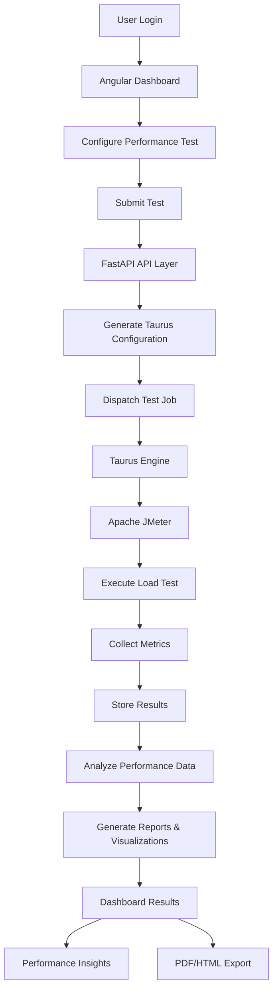

# PerfAnalyzer

PerfAnalyzer is a web-based platform that automates performance testing of websites and web applications using Apache JMeter and Taurus. It provides an intuitive dashboard for configuring tests, executing load scenarios, and analyzing performance metrics through detailed reports and visualizations.

## Features

- Web-based test configuration and execution
- Integration with Apache JMeter and Taurus
- Load, Stress, Spike, and Endurance Testing
- Real-time test monitoring
- Performance metrics and analytics
- Historical test result storage
- Interactive reports and visual dashboards

## Tech Stack

### Frontend
- Angular
- TypeScript
- Angular Material
- Chart.js

### Backend
- FastAPI
- Python

### Performance Testing
- Apache JMeter
- Taurus


## Workflow


```mermaid
flowchart TD
A[User Login] --> B[Angular Dashboard]
B --> C[Configure Performance Test]
C --> D[Submit Test]
D --> E[FastAPI API Layer]
E --> F[Generate Taurus Configuration]
F --> G[Dispatch Test Job]
G --> H[Taurus Engine]
H --> I[Apache JMeter]
I --> J[Execute Load Test]
J --> K[Collect Metrics]
K --> L[Store Results]
L --> M[Analyze Performance Data]
M --> N[Generate Reports & Visualizations]
N --> O[Dashboard Results]
O --> P[Performance Insights]
O --> Q[PDF/HTML Export]
```

## Status

🚧 Project under development.

## Project Structure
```
PerfAnalyzer/
├── .gitignore
├── LICENSE
├── README.md
├── perfAnalyzer-backend/
│   ├── jmx_builder.py
│   ├── main.py
│   ├── models.py
│   ├── services/
│   │   └── endpoint_discovery.py
│   ├── template.yml
│   └── yaml_builder.py
├── perfAnalyzer-frontend/
│   ├── .editorconfig
│   ├── .gitignore
│   ├── .prettierrc
│   ├── .vscode/
│   ├── README.md
│   ├── angular.json
│   ├── package-lock.json
│   ├── package.json
│   ├── public/
│   │   └── favicon.ico
│   ├── src/
│   │   ├── app/
│   │   │   └── components/
│   │   │       ├── admin-auth/
│   │   │       ├── admin-dashboard/
│   │   │       ├── auth/
│   │   │       ├── create-test/
│   │   │       ├── dashboard/
│   │   │       ├── logs/
│   │   │       ├── navbar/
│   │   │       ├── projects/
│   │   │       ├── reports-history/
│   │   │       ├── reports/
│   │   │       └── test-config/
│   │   ├── index.html
│   │   ├── main.server.ts
│   │   ├── main.ts
│   │   ├── server.ts
│   │   └── styles.css
│   ├── tsconfig.app.json
│   ├── tsconfig.json
│   └── tsconfig.spec.json
└── requirements.txt
```

## Future Enhancements

- Distributed Load Testing
- AI-Powered Performance Insights
- Scheduled Test Execution
- PDF Report Export
- Team Collaboration Features
